## Senzor intenzity osvětlení

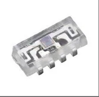

### Základní specifikace senzoru VEML7700

| **Parametr** | VEML7700 |
| :--- | :--- |
| **Výrobce** | Vishay Semiconductors |
| **Adresa zařízení** | `0x10` |
| **Velikost výstupních dat** | 16 bitů |
| **Napájecí napětí** | 2.5 až 3.6 V |
| **Pracovní teplota** | -25 °C až +85 °C |
| **Spotřeba při vypnutí** | až 0.5 µA |
| **Spotřeba při měření** | až 45 µA |
| **Měřicí rozsah** | 0 až 140 000 lx |
| **Měřicí rozlišení** | až 0.0042 lx |
| **Rozhraní** | I²C |
| **Velikost pouzdra** | 6.8 × 2.35 × 3.0 mm |
| **Cena** |  |

> **Poznámky:**  
>  [1] Uvedené hodnoty jsou stanoveny výrobcem pro teplotu okolí 25 °C a napájecím napětím 3.3V.  
>  [2] Při venkovním použití a vystavení přímému slunci je pro zamezení saturace zvoleno nastavení zesílení na hodnotu ALS gain x 1/8 a současně integrační čas 100 ms, přičemž výsledné rozlišení odpovídá hodnotě 0.5376 lx. 
>  [3] Režim úspory energie (PSM) je deaktivován (PSM_EN = 0) za účelem zajištění okamžité odezvy a plynulého měření. 
>  [4] Vypnutí a zapnutí senzoru je ovládáno pomocí bitu ALS_SD. 
>  [5] Při probuzení ze stavu vypnutí je nutné před prvním čtením dat dodržet čekací dobu minimálně 2.5 ms pro ustálení vnitřního oscilátoru.

### **Doporučené zapojení senzoru**  

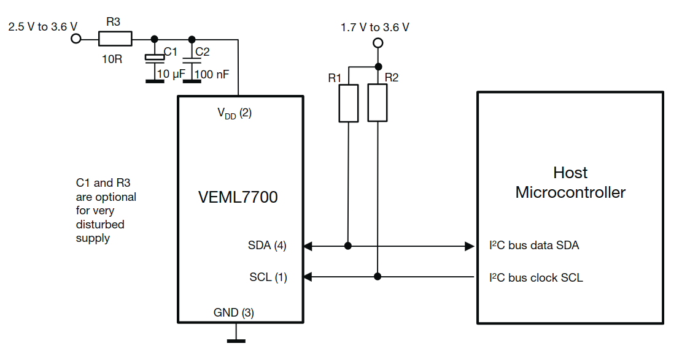

> **Poznámky:**  
>  [1] Doporučené hodnoty pull-up rezistorů (R1 a R2 na liniích SDA a SCL) jsou 2.2 kΩ až 4.7 kΩ (minimálně však > 1 kΩ). 
>  [2] Senzor je vysoce odolný vůči rušení a proto je dostačující připojit malý kondenzátor na napájecím pinů.

### **Související dokumentace**  
* [Datasheet VEML7700](datasheets/datasheet_veml7700.pdf)  
* [Application Note VEML7700](datasheets/application_note_veml7700.pdf)

 

## Senzor UV záření

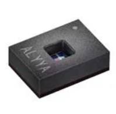

### Základní specifikace senzoru AS7331 

| **Parametr**| AS7331 |
| :--- | :--- |
| **Výrobce** | ams OSRAM |
| **Adresa zařízení** | `0x74`,`0x75`,`0x76`,`0x77` |
| **Velikost výstupních dat** | 16 bitů |
| **Napájecí napětí** | 2.7 až 3.6 V |
| **Měřené složky** | UVA, UVB, UVC |
| **Měřicí rozsah UVA** | 3,49 × 10⁵ µW/cm² |
| **Citlivost UVA** | 0,188 counts/(µW/cm²) |
| **Měřicí rozsah UVB** | 3,86 × 10⁵ µW/cm² |
| **Citlivost UVB** | 0,170 counts/(µW/cm²) |
| **Měřicí rozsah UVC** | 1,69 × 10⁵ µW/cm² |
| **Citlivost UVC** | 0,388 counts/(µW/cm²) |
| **Spotřeba při vypnutí** | až 1 µA |
| **Spotřeba při čekání** | až 970 µA |
| **Spotřeba při měření** | až 2 mA |
| **Pracovní teplota** | -40 °C až +85 °C |
| **Velikost pouzdra** | 3.65 × 2.60 × 1.09 mm |
| **Rozhraní** | I²C |
| **Cena** |  |

> **Poznámky:**  
>  [1] Uvedené hodnoty jsou stanoveny výrobcem pro teplotu okolí 25 °C a napájecím napětím 3.3V.  
>  [2] Hodnoty citlivosti a měřicího rozsahu jsou uvedeny pro konfiguraci GAIN = 1x. Toto minimální zesílení poskytuje maximální dynamický rozsah, který je nezbytný pro spolehlivé měření ve venkovním prostředí.

### **Doporučené zapojení senzoru**  
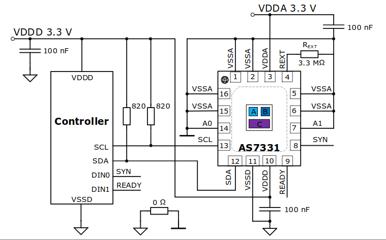

> **Poznámky:**  
>  [1] Hodnota pull-up rezistorů musí být >= 820 Ω.

### **Související dokumentace**  
* [Datasheet AS7331](datasheets/datasheet_as7331.pdf)  

 

## Senzor vlhkosti a teploty

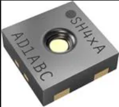

### Základní specifikace senzoru SHT40

| **Parametr**| SHT40 |
| :--- | :--- |
| **Výrobce** | SENSIRION |
| **Adresa zařízení** | `0x44` |
| **Velikost výstupních dat** | 16 bitů + 8 bitů (CRC) |
| **Napájecí napětí** | 1.08 až 3.6 V |
| **Spotřeba při čekání** | až 3.4 µA |
| **Spotřeba při měření** | až 500 µA |
| **Měřicí rozsah teploty** | -40 až 125 °C|
| **Měřicí rozlišení teploty** | 0.01 °C|
| **Přesnost měření teploty** | ±0.2 °C|
| **Měřicí rozsah vlhkosti** | 0 až 100 %|
| **Měřicí rozlišení vlhkosti** | 0.01 %|
| **Přesnost měření vlhkosti** | ±1.8 %|
| **Pracovní teplota** | -40 °C až +125 °C |
| **Velikost pouzdra** | 1.5 × 1.5 × 0.5 mm |
| **Rozhraní** | I²C |
| **Cena** |  |

> **Poznámky:**  
>  [1] Uvedené hodnoty jsou stanoveny výrobcem pro teplotu okolí 25 °C a napájecím napětím 3.3V.  
>  [2] Senzor je vybaven integrovaným topným tělískem s volitelným výkonem (až 200 mW) pro odpaření zkondenzované vlhkosti.
>  [3] Toto topné těleso není zohledněno v hodnotách uvedených v tabulce základních specifikací senzoru.

### **Doporučené zapojení senzoru**  
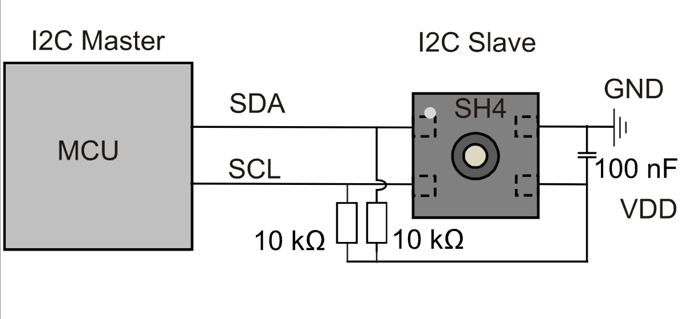

> **Poznámky:**  
>  [1] Hodnota pull-up rezistorů musí být >= 820 Ω.

### **Související dokumentace**  
* [Datasheet SHT40](datasheets/datasheet_sht40.pdf)
* [Application Note SHT40](datasheets/application_note_sht40.pdf)

 

## Senzor tlaku

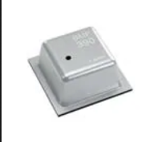

### Základní specifikace senzoru BMP390

| **Parametr**| BMP390 |
| :--- | :--- |
| **Výrobce** | BOSCH |
| **Adresa zařízení** | `0x77` |
| **Velikost výstupních dat** | 48 bitů|
| **Napájecí napětí** |  1.65 až 3.6 V |
| **Spotřeba při vypnutí** | až 1.5 µA|
| **Spotřeba při měření teploty** | až 320 µA |
| **Spotřeba při měření tlaku** | až 730 µA |
| **Měřicí rozsah teploty** | -40 až +85 °C|
| **Měřicí rozlišení teploty** | 0.00015 °C|
| **Přesnost měření teploty** | ±0.5 °C|
| **Měřicí rozsah tlaku** | 300 až 1250 hPa|
| **Měřicí rozlišení tlaku** | 0.085 Pa|
| **Přesnost měření tlaku** | ±0.33 hPa|
| **Pracovní teplota** | -40 °C až +85 °C |
| **Velikost pouzdra** | 2.0 x 2.0 x 0.75 mm |
| **Rozhraní** | I²C, SPI |
| **Cena** |  |

> **Poznámky:**  
>  Uvedené hodnoty jsou stanoveny výrobcem pro teplotu okolí 25 °C a napájecí napětí 3.3 V.  

### **Doporučené zapojení senzoru**  
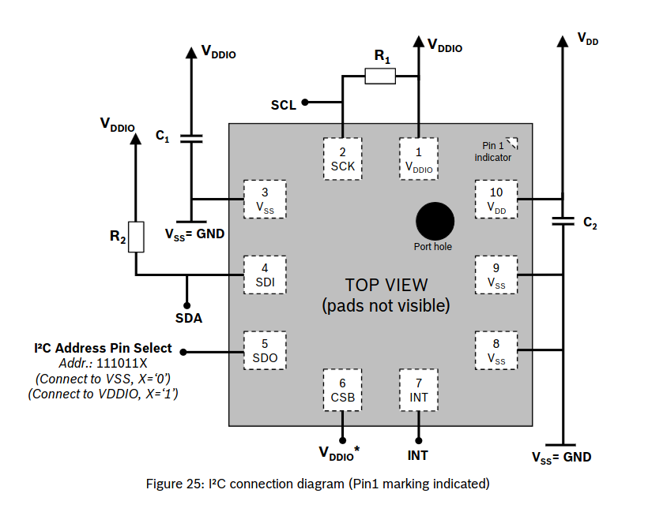

> **Poznámky:**  
>  [1] Doporučená hodnota pull-up rezistorů je 4.7 kΩ.

### **Související dokumentace**  
* [Datasheet BMP390](datasheets/datasheet_bmp390.pdf) 

 
 

## Magnetometr

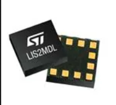

### Základní specifikace senzoru LIS2MDL

| **Parametr**| LIS2MDL |
| :--- | :--- |
| **Adresa zařízení** | `0x1E` |
| **Velikost výstupních dat** | 16 bitů|
| **Napájecí napětí** |  1.71 až 3.6 V |
| **Pracovní teplota** | -40 °C až +85 °C |
| **Spotřeba při měření** | až 120 µA |
| **Spotřeba při vypnutí** | až 1.5 µA|
| **Měřicí rozsah** | ±50 gauss |
| **Měřicí rozlišení** | 1.5 mgauss/LSB|
| **Přesnost měření** | 3 mgauss |
| **Velikost pouzdra** | 2.0 x 2.0 x 0.7 mm |
| **Rozhraní** | I²C, SPI |
| **Cena** |  |

> **Poznámky:**  
>  Uvedené hodnoty jsou stanoveny výrobcem pro teplotu okolí 25 °C a napájecí napětí 2.5 V.  
>  Senzor navíc obsahuje zabudovaný teplotní snímač sloužící k teplotní kompenzaci v okolí samotného magnetometru

### **Doporučené zapojení senzoru**  
> **Poznámky:**  
>  [1] Doporučené zapojení senzoru ani hodnoty pull up rezistorů nejsou uvedeny výrobcem.

### **Související dokumentace**  
* [Datasheet LIS2MDL](datasheets/datasheet_lis2mdl.pdf) 

 
 

## Senzor prachových částic

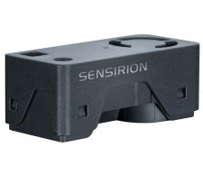

### Základní specifikace senzoru SEN62

| **Parametr**| SEN62 |
| :--- | :--- |
| **Adresa zařízení** | `0x6B` |
| **Velikost výstupních dat** | 144 bitů|
| **Napájecí napětí** |  3.15 až 3.6 V |
| **Pracovní teplota** | -10 °C až +60 °C |
| **Spotřeba při čekání** | 3.3 mA |
| **Spotřeba při měření** | 90 mA |
| **Měřené složky** | PM1, PM2.5, PM4, PM10 |
| **Měřicí rozsah** | 0 až 1000 μg/m3 |
| **Přesnost PM1 a PM2.5 (0 až 100 µg/m³)** | ±(5 µg/m³ + 5 % z naměřené hodnoty) |
| **Přesnost PM1 a PM2.5 (100 až 1000 µg/m³)** | ±10 % z naměřené hodnoty |
| **Přesnost PM4 a PM10 (0 až 100 µg/m³)** | ±25 µg/m³ |
| **Přesnost PM4 a PM10 (100 až 1000 µg/m³)** | ±25 % z naměřené hodnoty |
| **Velikost pouzdra** | 55.2 × 29.9 × 19.2 mm |
| **Rozhraní** | I²C |
| **Cena** |  |

> **Poznámky:**  
>  [1] Uvedené hodnoty jsou stanoveny výrobcem pro teplotu okolí 25 °C, napájecí napětí 3.3 V, vlhkost vzduchu 50 % a tlak 1013 mbar.  
>  [2] Krátkodobé proudové špičky při měření dosahují až 190 mA
>  [3] Senzor navíc obsahuje zabudovaný snímač teploty a vlhkosti sloužící ke kompenzaci vlhkosti a teploty v okolí samotného magnetometru

### **Doporučené zapojení senzoru**  
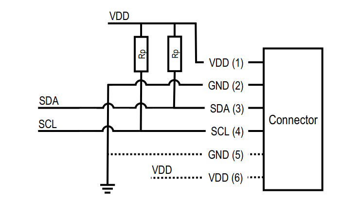

> **Poznámky:**  
>  [1] Doporučená hodnota pull-up rezistorů je 10 kΩ.

### **Související dokumentace**  
* [Datasheet SEN62](datasheets/datasheet_sen62.pdf)

 

## Senzor rychlosti větru

## Senzor směru větru

## Senzor srážek
| **Cena** |  |

